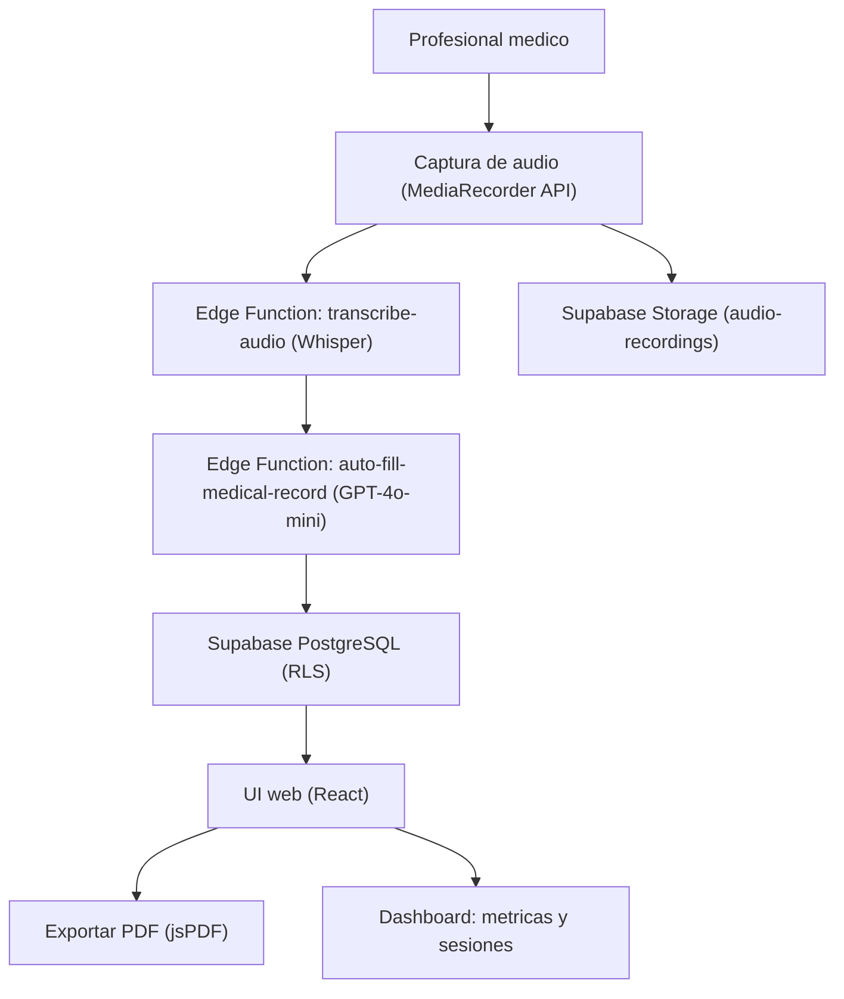

# Medivoz Smart Scribe

Sistema de transcripcion medica asistida por IA que convierte conversaciones doctor-paciente en fichas medicas electronicas estructuradas.

## Como funciona



## Caracteristicas

- **Grabacion en tiempo real** — Captura de audio del encuentro medico desde el navegador
- **Transcripcion IA** — Audio a texto via OpenAI Whisper (Edge Function con JWT auth)
- **Auto-relleno de ficha clinica** — GPT-4o-mini genera fichas medicas estructuradas desde la transcripcion
- **Gestion de pacientes** — CRUD completo de expedientes clinicos
- **Agentes IA configurables** — Edicion de prompt, temperatura, tipo y estado por doctor (persistidos en DB)
- **Orquestacion visual** — Canvas ReactFlow que muestra el pipeline Transcriptor → Extractor
- **Sesiones e historial** — Registro de consultas con audio persistido en Storage
- **Exportacion PDF** — Descarga de fichas medicas en PDF (jsPDF + autoTable)
- **Dashboard** — Estadisticas de pacientes, sesiones y fichas con accesos rapidos
- **Dark mode** — Tema claro/oscuro via CSS class

## Stack

| Capa | Tecnologia |
|------|-----------|
| Frontend | React 18, TypeScript (strict), Vite + SWC |
| UI | shadcn/ui, Tailwind CSS, Lucide icons, ReactFlow |
| Estado | TanStack React Query, React Context (Auth, Theme, Agents) |
| Formularios | React Hook Form + Zod |
| Backend | Supabase (PostgreSQL, Auth, Edge Functions, Storage) |
| IA | OpenAI GPT-4o-mini (auto-fill), Whisper (transcripcion) |
| Testing | Vitest, React Testing Library, jest-dom |
| CI/CD | GitHub Actions (lint → typecheck → test → build) |
| Monitoreo | Sentry (opcional, solo produccion) |
| Deploy | Lovable (auto-deploy desde GitHub) |

## Base de datos

Todas las tablas tienen Row Level Security (RLS) habilitado.

| Tabla | Descripcion |
|-------|------------|
| `pacientes` | Expedientes de pacientes (por `doctor_id`) |
| `fichas_medicas` | Fichas clinicas estructuradas (por `paciente_id`, `sesion_id`) |
| `sesiones` | Sesiones de grabacion con `audio_url` a Storage |
| `profiles` | Perfiles de doctores |
| `user_roles` | Roles de usuario (doctor, admin) |
| `agents` | Configuracion de agentes IA por doctor (UNIQUE por `doctor_id` + `nombre`) |

## Rutas

| Ruta | Descripcion | Auth |
|------|------------|------|
| `/` | Landing page | Publica |
| `/login` | Inicio de sesion | Publica |
| `/signup` | Registro | Publica |
| `/dashboard` | Panel principal con estadisticas | Privada |
| `/patients` | Gestion de pacientes | Privada |
| `/session` | Grabar consulta | Privada |
| `/history` | Historial de sesiones | Privada |
| `/agents` | Configuracion de agentes IA | Privada |
| `/agents/:id` | Editar agente individual | Privada |

## Instalacion

```bash
git clone https://github.com/BrikHMP18/medivoz-smart-scribe.git
cd medivoz-smart-scribe
npm install
```

### Variables de entorno

Copia `.env.example` a `.env` y configura:

```env
VITE_SUPABASE_URL=https://tu-proyecto.supabase.co
VITE_SUPABASE_ANON_KEY=tu-anon-key

# Opcional (produccion)
VITE_SENTRY_DSN=https://...@sentry.io/...
```

> Las claves anon de Supabase son publicas por diseno. La seguridad real esta en las RLS policies.

### Supabase

```bash
supabase link --project-ref tu-project-ref
supabase db push

# Edge Functions
supabase functions deploy transcribe-audio
supabase functions deploy auto-fill-medical-record
```

En **Supabase > Edge Functions > Settings**, configura los secrets:

```
OPENAI_API_KEY=sk-...
OPENAI_MODEL=gpt-4o-mini
```

## Desarrollo

```bash
npm run dev          # Servidor en http://localhost:8080
npm run build        # Build produccion (minificado, sin sourcemaps)
npm run build:dev    # Build con sourcemaps
npm run preview      # Servir dist/ localmente
npm run lint         # ESLint
npm run format       # Prettier
npm test             # Vitest (run)
npm run test:watch   # Vitest (watch)
npm run test:coverage # Cobertura
```

## Deploy

El proyecto usa **Lovable** conectado al repo de GitHub. Al pushear a `main`:

1. GitHub Actions ejecuta: lint → typecheck → test → build
2. Lovable detecta el push y reconstruye automaticamente

```bash
git push origin main   # Trigger deploy
```

**URL produccion:** https://medivoz-smart-scribe.lovable.app/

## Estructura del proyecto

```
src/
├── components/
│   ├── agents/          # AgentFlow, AgentForm, AgentBasicInfo
│   ├── auth/            # LoginForm, SignupForm
│   ├── common/          # Logo, componentes compartidos
│   ├── landing/         # Landing page
│   ├── layout/          # Sidebar, Navbar
│   ├── medical-record/  # Ficha medica, formularios
│   ├── patients/        # Gestion de pacientes
│   ├── session/         # SessionRecorder, SessionPatientCard
│   └── ui/              # shadcn/ui (Radix + Tailwind)
├── contexts/            # AuthContext, ThemeContext, AgentsContext
├── hooks/
│   ├── medical-record/       # CRUD, transcripcion, PDF
│   └── medical-record-auto-fill/  # Auto-fill con timeout
├── integrations/supabase/    # Cliente, tipos auto-generados
├── pages/                    # Paginas (lazy-loaded)
├── utils/                    # Logger (env-aware + Sentry)
└── test/                     # Setup de Vitest
supabase/
├── functions/
│   ├── transcribe-audio/          # Audio → Whisper → texto
│   └── auto-fill-medical-record/  # Texto → GPT-4o-mini → ficha JSON
└── migrations/                    # Migraciones SQL
```

## Licencia

Ver archivo [LICENSE](LICENSE).
